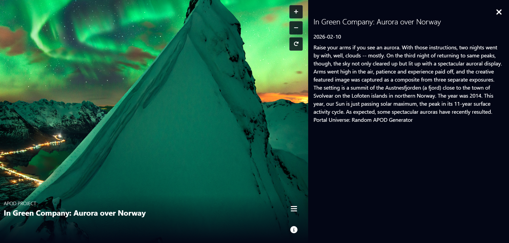
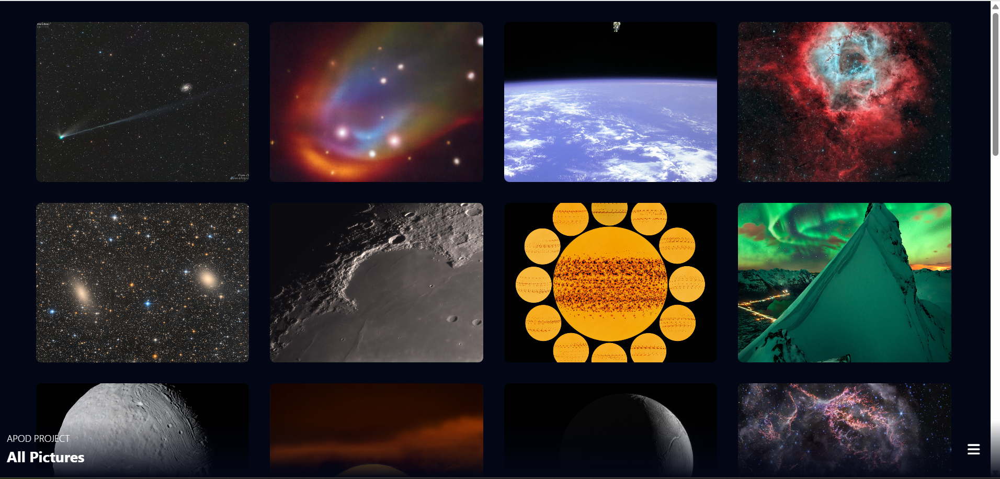
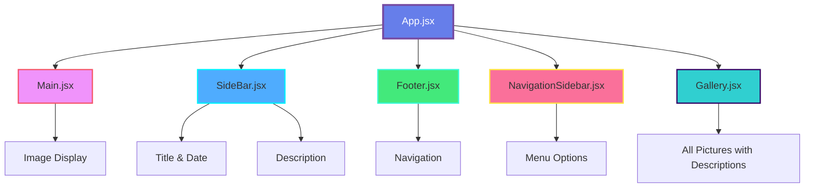

<div align="center">

# 🌌 NASA APOD EXPLORER 🚀


<br/>


<br/>

[](https://api.nasa.gov/)
[](https://reactjs.org/)
[](https://vitejs.dev/)
[](LICENSE)
[](https://github.com/shekhawatmuskan/nasa-react-app)

<br/>

### 🌠 _Journey through space, one image at a time_ 🌠

<br/>

<p align="center">
  <a href="#-features">Features</a> •
  <a href="#-demo">Demo</a> •
  <a href="#-installation">Installation</a>
</p>

<br/>


</div>

<br/>

## 🌍 About The Project

<div align="center">
  
<table>
<tr>
<td width="50%">

### 🎯 What is APOD?

**Astronomy Picture of the Day** (APOD) is one of NASA's most popular websites, featuring a different space or astronomy-related image each day, along with a brief explanation written by a professional astronomer.

</td>
<td width="50%">

### 🚀 Mission

To bring the wonders of the universe to your fingertips through a beautiful, modern, and intuitive React application that showcases NASA's incredible imagery.

</td>
</tr>
</table>

<br/>

### 📸 Project Overview





</div>

<br/>

## ✨ Features

<div align="center">

<table>
<tr>
<td align="center" width="33%">

<br/><br/>
<b>🎨 Stunning UI</b>
<br/><br/>
Beautiful, modern interface with smooth animations and responsive design
</td>
<td align="center" width="33%">

<br/><br/>
<b>🌠 NASA Integration</b>
<br/><br/>
Direct integration with NASA's official APOD API for authentic content
</td>
<td align="center" width="33%">

<br/><br/>
<b>📖 Expert Explanations</b>
<br/><br/>
Professional astronomical explanations from NASA astronomers
</td>
</tr>
<tr>
<td align="center" width="33%">

<br/><br/>
<b>📱 Fully Responsive</b>
<br/><br/>
Seamless experience across desktop, tablet, and mobile devices
</td>
<td align="center" width="33%">

<br/><br/>
<b>⚡ Lightning Fast</b>
<br/><br/>
Built with Vite for optimal performance and instant load times
</td>
<td align="center" width="33%">

<br/><br/>
<b>🗓️ Daily Updates</b>
<br/><br/>
Fresh cosmic imagery and content updated automatically every day
</td>
</tr>
</table>

</div>

<br/>


<br/>

## 🛠️ Built With

<div align="center">

<table>
<tr>
<td align="center" width="20%">

<br/>React
</td>
<td align="center" width="20%">

<br/>Vite
</td>
<td align="center" width="20%">

<br/>JavaScript
</td>
<td align="center" width="20%">

<br/>CSS3
</td>
<td align="center" width="20%">

<br/>HTML5
</td>
</tr>
</table>

<br/>

```javascript
const techStack = {
  frontend: ["React", "JavaScript ES6+", "CSS3"],
  buildTool: "Vite",
  api: "NASA APOD API",
  features: ["Responsive Design", "Dynamic Content", "Modern UI/UX"],
};
```

</div>

<br/>


<br/>

## 📁 Project Structure

```
nasa-apod-explorer/
├── public/
│   ├── mars.png
│   └── vite.svg
├── src/
│   ├── assets/
│   │   ├── react.svg
│   │   ├── Screenshot.png
│   │   └── menu.png
│   ├── components/
│   │   ├── App.jsx
│   │   ├── Footer.jsx
│   │   ├── Main.jsx
│   │   ├── SideBar.jsx
│   │   ├── NavigationSidebar.jsx
│   │   └── Gallery.jsx
│   ├── index.css
│   └── main.jsx
├── .env                     # Environment variables (NASA API key)
├── .gitignore
├── index.html
├── package.json
└── README.md
```

<br/>


<br/>

## 🚀 Getting Started

<div align="center">

### 🎯 Prerequisites

<table>
<tr>
<td align="center">

<br/><b>Node.js</b><br/>v14.0 or higher
</td>
<td align="center">

<br/><b>npm</b><br/>v6.0 or higher
</td>
<td align="center">

<br/><b>NASA API Key</b><br/>Free registration
</td>
</tr>
</table>

</div>

<br/>

### 📥 Installation

<details open>
<summary><b>Step 1️⃣ : Clone the Repository</b></summary>

<br/>

```bash
# HTTPS
git clone https://github.com/shekhawatmuskan/nasa-react-app.git

# SSH
git clone git@github.com:shekhawatmuskan/nasa-react-appr.git

# GitHub CLI
gh repo clone shekhawatmuskan/nasa-react-app
```

</details>

<details open>
<summary><b>Step 2️⃣ : Navigate to Project Directory</b></summary>

<br/>

```bash
cd nasa-react-app
```

</details>

<details open>
<summary><b>Step 3️⃣ : Install Dependencies</b></summary>

<br/>

```bash
npm install
```


**This will install:**

- ⚛️ React and React DOM
- ⚡ Vite and build tools
- 🔧 ESLint for code quality
- 📦 All project dependencies

</details>

<details open>
<summary><b>Step 4️⃣ : Get Your NASA API Key 🔑</b></summary>

<br/>

1. Visit [**NASA API Portal**](https://api.nasa.gov/) 🌐
2. Fill out the simple registration form 📝
3. Receive your API key instantly via email 📧
4. Copy your unique API key 📋

> 💡 **Tip:** NASA API keys are free and provide generous rate limits!

</details>

<details open>
<summary><b>Step 5️⃣ : Configure Environment Variables</b></summary>

<br/>

Create a `.env` file in the root directory:

```env
# NASA API Configuration
VITE_NASA_API_KEY=your_actual_api_key_here

# Optional: Add custom configurations
# VITE_API_BASE_URL=https://api.nasa.gov
```

> ⚠️ **Important:** Never commit your `.env` file to version control!

</details>

<details open>
<summary><b>Step 6️⃣ : Launch the Application 🎉</b></summary>

<br/>

```bash
npm run dev
```


**Your app will be running at:**

```
🌐 Local:   http://localhost:5173/
📱 Network: http://192.168.x.x:5173/
```

</details>

<br/>

<div align="center">

### 🎊 Congratulations! You're ready to explore the cosmos! 🌌


</div>

<br/>


<br/>

## 🧩 Component Architecture

<div align="center">



<br/>

### 📦 Component Details

<table>
<tr>
<td align="center" width="25%">


**App.jsx**

🎮 Main Controller

- State Management
- API Integration
- Data Flow Control

</td>
<td align="center" width="25%">


**Main.jsx**

🖼️ Image Display

- Responsive Layout
- Media Rendering
- Visual Effects

</td>
<td align="center" width="25%">


**SideBar.jsx**

📊 Information Panel

- Title Display
- Date Information
- Description Text

</td>
<td align="center" width="25%">


**Footer.jsx**

🦶 Navigation

- App Controls
- Extra Info
- Links

</td>
</tr>
<tr>
<td align="center" width="25%">


**NavigationSidebar.jsx**

📋 Navigation Menu

- Access to all pictures stored by NASA
- Browse images with their descriptions
- Menu toggle functionality

</td>
<td align="center" width="25%">


**Gallery.jsx**

🖼️ Gallery View

- Displays all pictures from NASA
- Shows images with their descriptions
- Grid layout for easy browsing

</td>
</tr>
</table>

</div>

<br/>


<br/>

<br/>

<div align="center">

**If you found this project helpful, please give it a ⭐!**

<br/>


</div>

<br/>
